# boot2CrudContainer
Spring Boot App with REST WebServices in Docker Container with Kubernetes and Helm & Istio

## Setup on Ubuntu
### Install through UI: krusader, kate, konsole, docker, minikube
### Install through web: STS - Spring Tool Suite 4
### Install through cmd: jdk, curl, git, dockerd(docker.io)
	$ sudo apt install default-jdk
	$ sudo apt install curl
	$ sudo apt install git
	$ sudo apt install docker.io
	$ sudo apt install socat
	$ sudo apt install net-tools
### on VMWare, install VMWare Tools as sudo vmware-install.pl

## Java Development: with STS - Spring Tool Suite 4
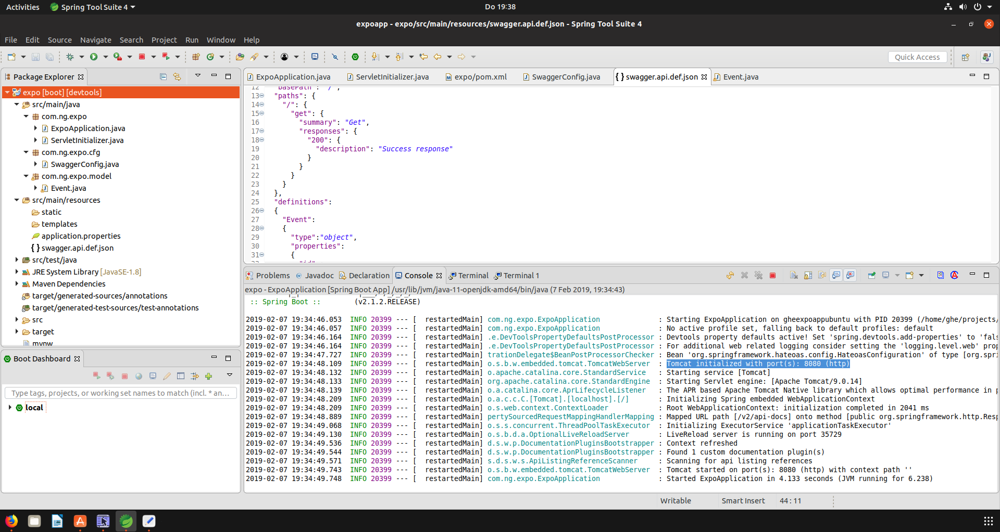

## Swagger
### Editor (JSON or YAML)

[./src/main/resources/swagger.api.def.json](./src/main/resources/swagger.api.def.json)

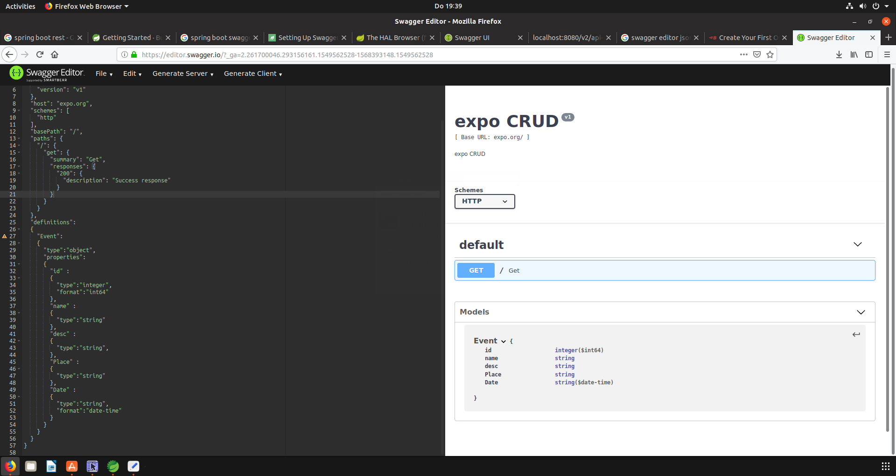
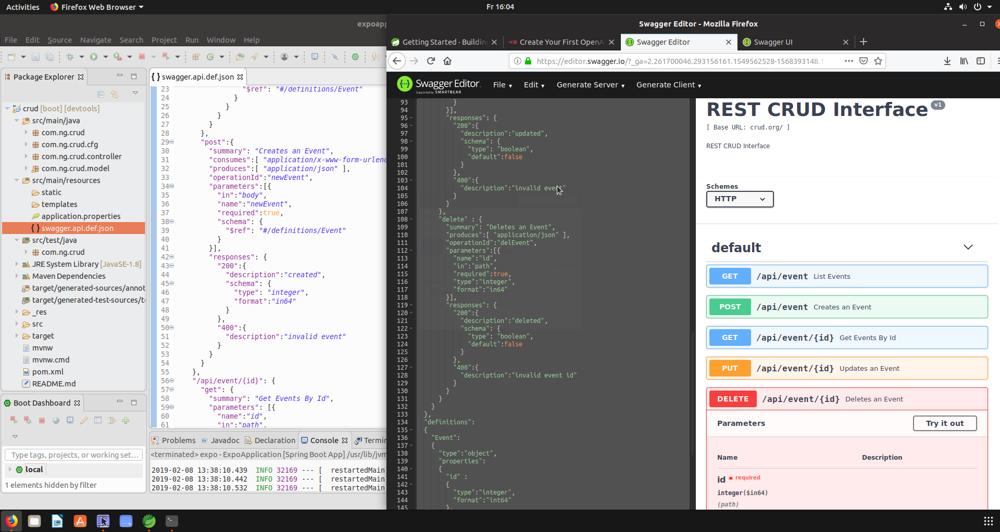

### Browser - showing the REST API of the App
http://localhost:8080/swagger-ui.html
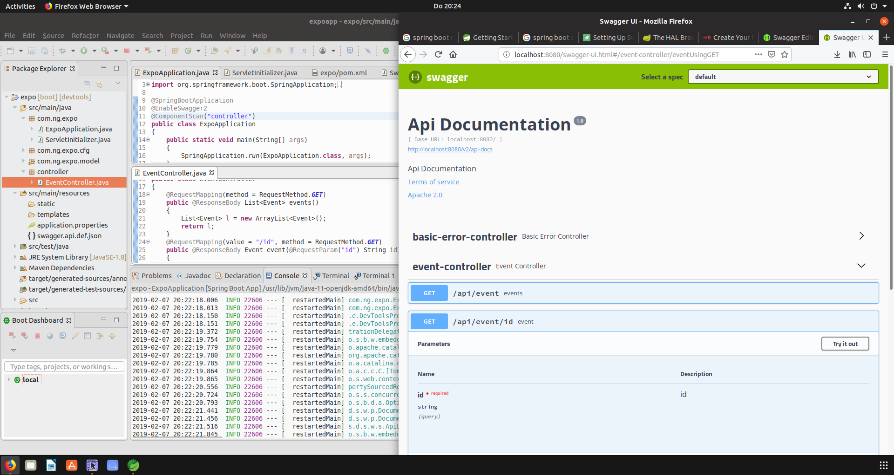

## Docker build & run
(optional: you can docker-build through a maven-goal too (with a maven plug-in inserted in your pom.xml))

Docker resources:

1. [./Dockerfile](./Dockerfile)

.

```sh
sudo bash 							# console as root
docker build -t boot2crud_image .
docker run -d -p 9090:8080 --name boot2crud_container boot2crud_image
docker ps							# lists running images --> open browser: http://localhost:9090/swagger-ui.html
docker kill boot2crud_container
docker ps -a						# lists killed containers too...
```
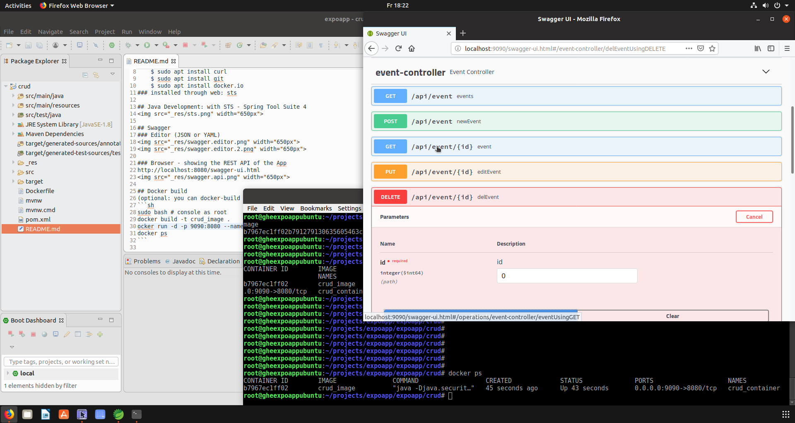

## k8s - local Setup
In a VM, pre-requisite is numCPU>1
```sh
docker run -d -p 5000:5000 --restart=always --name registry registry:2	# alternative: minikube addons enable registry
docker build -t boot2crud_image .
docker tag boot2crud_image localhost:5000/boot2crud_image
docker push localhost:5000/boot2crud_image

### if you want to use kvm as k8s-minikube-vm-driver:
# apt install libvirt-clients libvirt-daemon-system qemu-kvm
# usermod -a -G libvirt $(whoami)
# newgrp libvirt

grep -c ^processor /proc/cpuinfo	# returns numCPU
curl -Lo kubectl https://storage.googleapis.com/kubernetes-release/release/v1.13.2/bin/linux/amd64/kubectl && chmod +x kubectl && sudo cp kubectl /usr/local/bin/ && rm kubectl
curl -Lo minikube https://storage.googleapis.com/minikube/releases/latest/minikube-linux-amd64 && chmod +x minikube
cp minikube /usr/local/bin
minikube start --vm-driver=kvm2 --insecure-registry localhost

minikube dashboard 

# remember to turn off the imagePullPolicy:Always, as otherwise Kubernetes won't use images you built locally.

## expose deployment manually:
kubectl apply -f ./k8s/deployment.yaml
kubectl expose deployment boot2crud-deployment --port=8080
minikube service boot2crud-deployment --url		# better: look minikube dashboard -> Services -> boot2crud-service -> Endpoints

## expose through service definition:
kubectl apply -f ./k8s/service.yaml
minikube service boot2crud-deployment --url		# better: look minikube dashboard -> Services -> boot2crud-service -> Endpoints

## cleanup
kubectl delete -f ./k8s/service.yaml
kubectl delete deployment boot2crud-deployment
```
Deployment- & Service defintions:

1. [./k8s/deplyoment.yaml](./k8s/deployment.yaml)
2. [./k8s/service.yaml](./k8s/service.yaml)

### Local Minikube Dashboard listing exposed Deployment Endpoint:
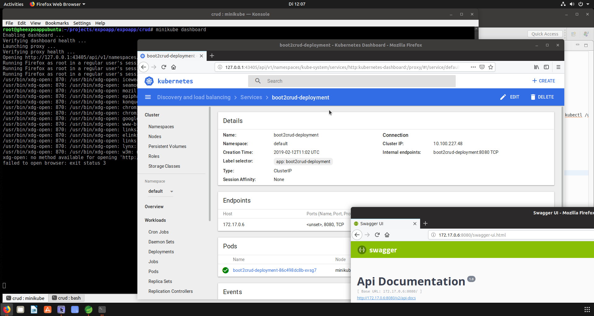

### Gotchas
1. if the pod CoreDNS is in CrashLoopBackOff
	1. try to change the nameserver entry in /etc/resolv.conf & restart:
		kubectl -n kube-system delete pod -l k8s-app=kube-dns
		or
	2. try to
		1. kubectl edit cm coredns -n kube-system # starts cfg in vi
		2. delete line 'loop'
			1. vi-edit mode: i
			2. vi-save: [ESC]-:w
			3. vi-quit: [ESC]-:q!
		3. restart pods

## Helm
### Install on Ubuntu
```sh
curl https://raw.githubusercontent.com/helm/helm/master/scripts/get > get_helm.sh
chmod 700 get_helm.sh
./get_helm.sh
helm init	# = sets up helm (happens here nothing project-specific, just machine specific setup in $HOME/.helm)
apt install socat
kubectl get pods --namespace kube-system	# now, tiller(=helm-server-side) will be listed
```
### Usage
helm chart (placeholder configuration):
[./helm/boot2crud-helmworkflow/](./helm/boot2crud-helmworkflow/)
```sh
cd helm
helm create boot2crud-helmworkflow
# edit placeholder values manually in the created yaml files...
helm install boot2crud-helmworkflow/ 		# outputs also the created deployment name
# cleanup:
helm delete <deployment-name>
```

#### Helm installed chart:
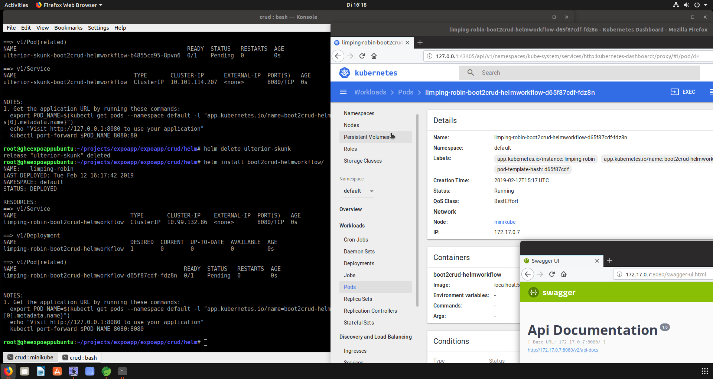

#### TODO: solve 'Liveness probe failed' on local deployment

## Istio
```sh
curl -L https://git.io/getLatestIstio | sh -
# kubectl apply -f install/kubernetes/istio-demo-auth.yaml			# without helm
# better with helm (here allowing local(minikube) egress traffic!):
helm template install/kubernetes/helm/istio --name istio --namespace istio-system --set servicegraph.enable=true --set tracing.enabled=true --set grafana.enabled=true --set servicegraph.enabled=true --set global.proxy.includeIPRanges="10.0.0.1/24" > ./istio4boot2crud.yaml
# ^this is on minikube, on the cloud set differently IP range!, see: https://istio.io/docs/tasks/traffic-management/egress/#calling-external-services-directly
kubectl create namespace istio-system
kubectl apply -f ./istio4boot2crud.yaml
kubectl label namespace default istio-injection=enabled

kubectl get svc -n istio-system 	# lists the installed istio components
kubectl get pods -n istio-system	# wait until pods are started (takes several minutes!)

kubectl get po -n istio-system
kubectl port-forward grafana-59b8896965-5892z -n istio-system 3000

## enable auto-sidecar injection into new pods:
kubectl label namespace default istio-injection=enabled
kubectl get namespace -L istio-injection

## uninstall istio:
#kubectl delete -f install/kubernetes/istio-demo-auth.yaml
#kubectl delete -f istio4boot2crud.yaml						# ...or with the helm-generated yaml!
helm delete --purge istio									# if installed with helm
```

#### helm-generated istio-setup yaml:
[./k8s/istio4boot2crud.yaml](./k8s/istio4boot2crud.yaml)

### Istio-provided Dashboards & Graphs
1. Prometheus URL: see k8s dashboard, eg. http://172.17.0.16:9090/graph
2. in Grafana (eg. http://172.17.0.13:3000/datasources/edit/1 ), edit Prometheus URL, set it to http://172.17.0.16:9090/
3. zipkin
4. jaeger

### Grafana setting for Prometheus: 

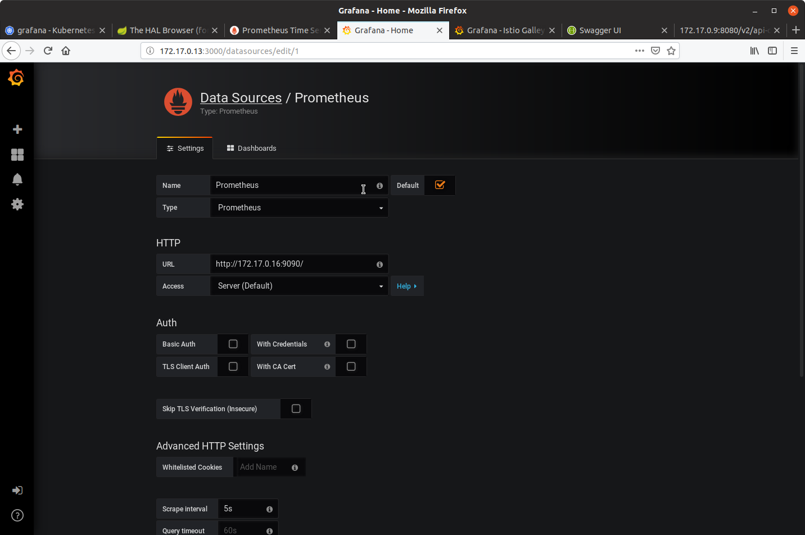

#### Grafana Dashboard graphing the boot2crud app:

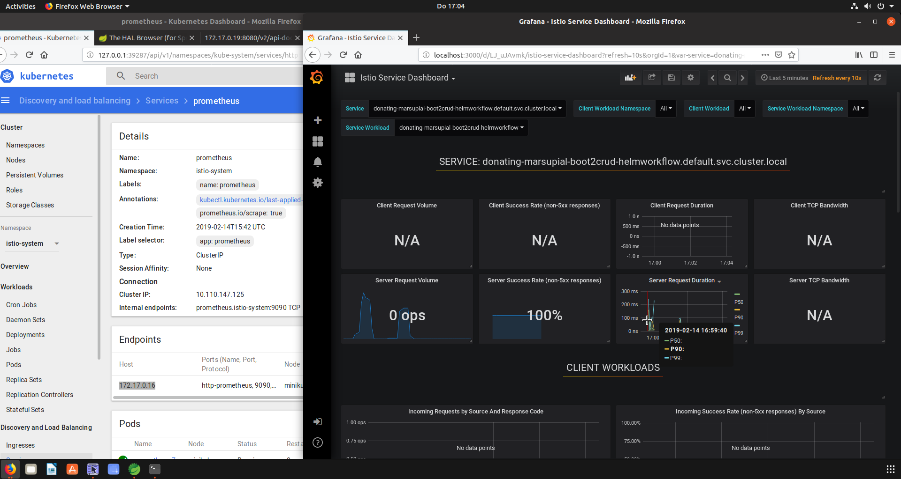

#### Prometheus graphing the boot2crud app:

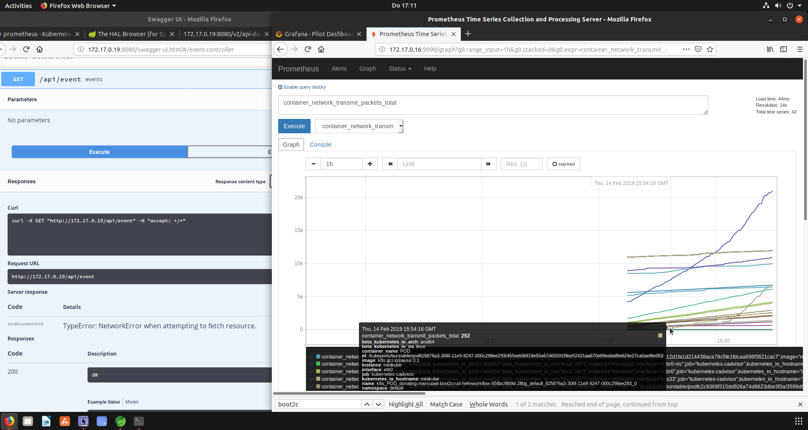

#### Jaeger tracing the boot2crud app:

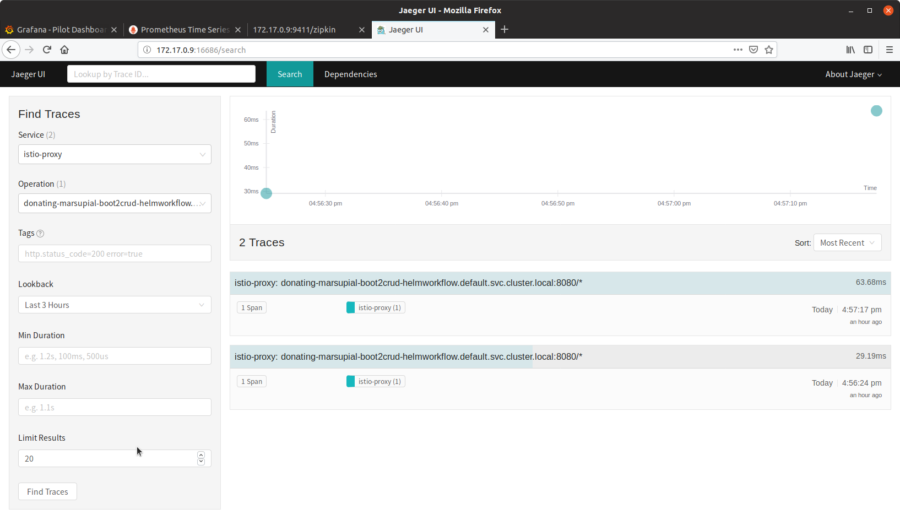
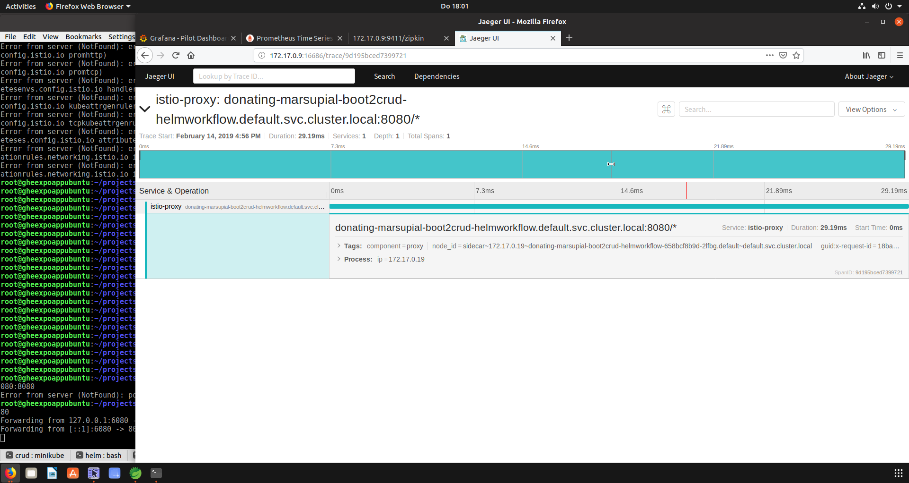

### Istio troubleshooting
```sh
# see if sidecar-injector set up correctly:
kubectl proxy & curl -s localhost:7771/metrics | grep sidecar-injector
...don't forget to kill it later:
netstat -tulp | grep kubectl
kill -9 <pid>
## check istio endpoints on
http://127.0.0.1:8001/

## if injector not working, try to recreate...
kubectl get pods -n istio-system
kubectl delete pod istio-sidecar-injector-768c79f7bf-92b76 -n istio-system

## get local running pod in local browser:
kubectl get pods
kubectl port-forward donating-marsupial-boot2crud-helmworkflow-658bcf8b9d-2lfbg 6080:8080

## allow egress(=outgoing) traffic:
kubectl <your-istio-helm-installation> apply --set global.proxy.includeIPRanges="10.0.0.1/24" -x templates/sidecar-injector-configmap.yaml
# ^this is on minikube, on the cloud set differently IP range!, see: https://istio.io/docs/tasks/traffic-management/egress/#calling-external-services-directly

```

## CRUD with H2
#### Test setup with in memory H2 database:
[./src/main/resources/application-test.properties](./src/main/resources/application-test.properties)
 (hint: start STS Spring-Boot App with Profile=test)
#### UI of the H2 console and the CRUD app:
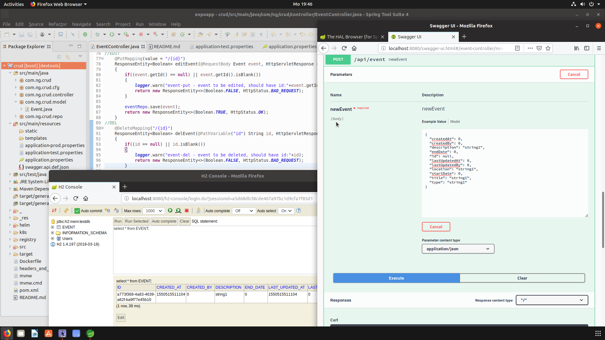

#### Unit Test for REST Controller:
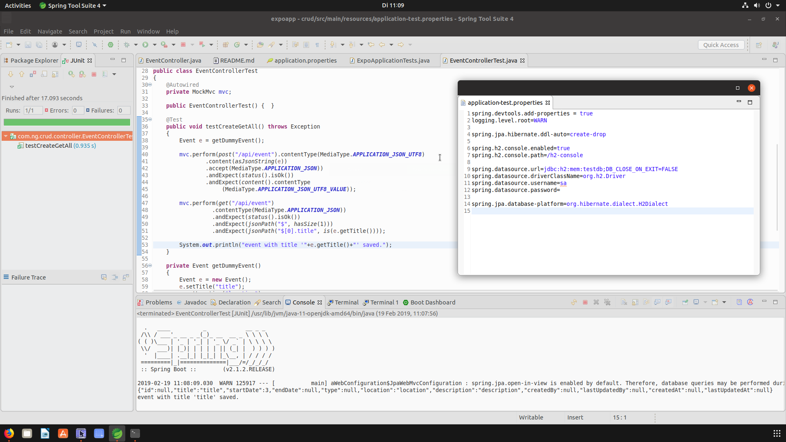

## TODO:
1. helm - local with liveness & readiness probe (hint: try to adjust the istio ingress/egress rules)
2. functional/reactive java CRUD implementation
3. configure swagger code-generation:
	1. https://github.com/swagger-api/swagger-codegen/wiki/Server-stub-generator-HOWTO#java-springboot
	2. http://central.maven.org/maven2/io/swagger/swagger-codegen-cli/2.4.1/swagger-codegen-cli-2.4.1.jar
	3. java -jar swagger-codegen-cli.jar generate -i CrudApp_0.0.2.yaml -l spring -o generated/spring-server -c CrudApp_config.json
