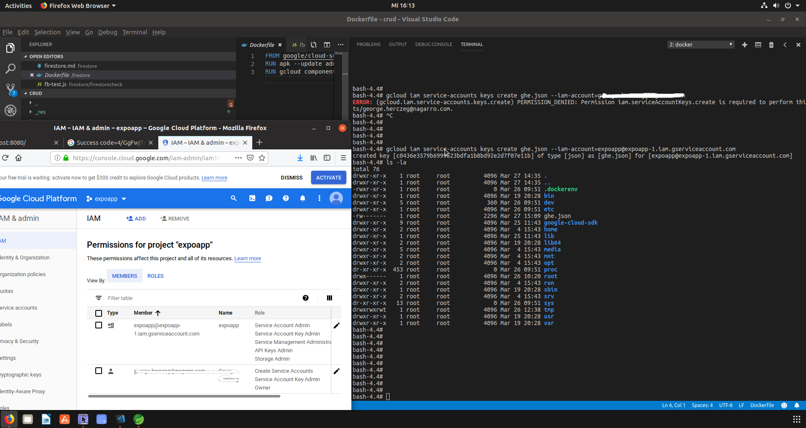
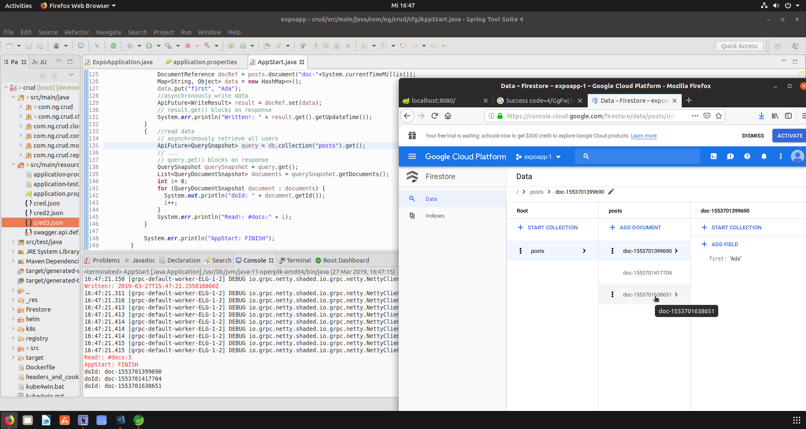

# Firestore
## Build firestore Emulator as Docker image
```sh
# build docker image
docker build -t my_google_sdk_docker:alpine .
# del: docker rmi my_google_sdk_docker:alpine
# check if image built:
docker image ls | grep my_google_sdk_docker
# TAKE CARE: **ONLY** localhost:8080 is supported by the nodejs lib '@firebase/testing'
# //TODO: is persistence necessary? (-v ${PWD}/firestore-data:/opt/data)
docker run --rm -p 8080:8080 -it -e "FIRESTORE_PROJECT_ID=expoapp" --name my_gcloud my_google_sdk_docker:alpine /bin/bash
> gcloud components list
> gcloud beta emulators firestore start --host-port=0.0.0.0:8080

# advanced: start everything in one line:
docker run --rm -p 8080:8080 -it -e "FIRESTORE_PROJECT_ID=expoapp" --name my_gcloud my_google_sdk_docker:alpine /bin/bash -c "gcloud beta emulators firestore start --host-port=0.0.0.0:8080"
```
```sh
# working inside of the container (write in another console):
docker exec -it my_gcloud /bin/bash
> ... 
> exit
# cleanup
docker kill my_gcloud
```
check: localhost:<PORT>/ should show 'Ok' in a browser<br>
export FIRESTORE_EMULATOR_HOST=localhost:8080

#### Running emulated gloud in docker container:


#### Running firestore-testing (NodeJS API):


## gcloud commands
```sh
gcloud config list
gcloud config set core/account expo
gcloud auth login
gcloud projects list
# to be used in the JAVA API:
gcloud iam service-accounts keys create --iam-account expoapp@expoapp-1.iam.gserviceaccount.com cred.json
# alternative: generate app default credentials
gcloud auth application-default login           # Credentials saved to file: [/root/.config/gcloud/application_default_credentials.json]
```

### GCLOUD - Create service account key for the Java API


### GCLOUD - Java API usage:


## Setup Steps
* create gcloud account; start in the gcloud-docker-container:
    * gcloud auth login         # refers to the URL to be used for login/signup
* login on https://gcloud.console.google.com/
* on the IAM page: create service account
* on the Firestore page: create firestore database
* in the gcloud-docker-container:
    * gcloud auth login
    * gcloud config set ...     # set project-id(expoapp-1), set account name(your email)
    * gcloud projects list      # verify your project is known
    * gcloud config list        # verify your project-id & name are set
    * gcloud iam service-accounts keys create --iam-account expoapp@expoapp-1.iam.gserviceaccount.com cred.json
* use the generated cred.json when accessing the firestore service; see:
    * [../src/main/resources/cred.json](../src/main/resources/cred.json)
    * [../src/main/java/com/ng/crud/cfg/AppStart.java](../src/main/java/com/ng/crud/cfg/AppStart.java)

