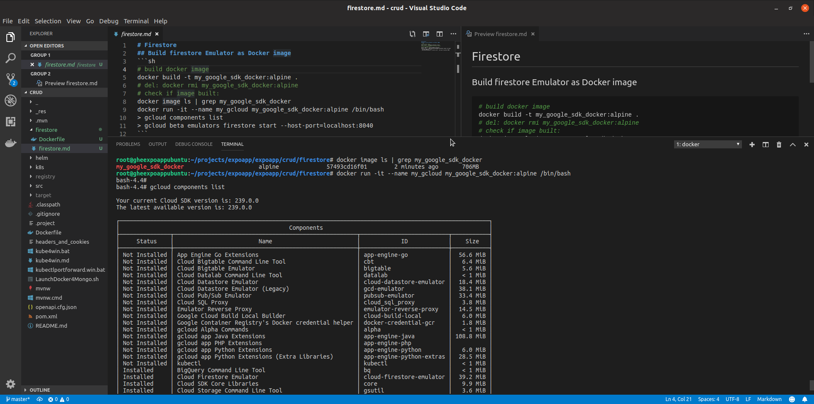
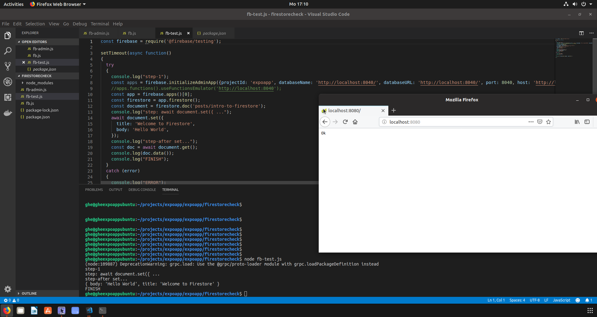

# Firestore
## Build firestore Emulator as Docker image
```sh
# build docker image
docker build -t my_google_sdk_docker:alpine .
# del: docker rmi my_google_sdk_docker:alpine
# check if image built:
docker image ls | grep my_google_sdk_docker
# TAKE CARE: **ONLY** localhost:8080 is supported by the nodejs lib '@firebase/testing'
# //TODO: is persistence necessary? (-v ${PWD}/firestore-data:/opt/data)
docker run --rm -p 8080:8080 -it -e "FIRESTORE_PROJECT_ID=expoapp" --name my_gcloud my_google_sdk_docker:alpine /bin/bash
> gcloud components list
> gcloud beta emulators firestore start --host-port=0.0.0.0:8080

# advanced: start everything in one line:
docker run --rm -p 8080:8080 -it -e "FIRESTORE_PROJECT_ID=expoapp" --name my_gcloud my_google_sdk_docker:alpine /bin/bash -c "gcloud beta emulators firestore start --host-port=0.0.0.0:8080"
```
```sh
# working inside of the container (write in another console):
docker exec -it my_gcloud /bin/bash
> ... 
> exit
# cleanup
docker kill my_gcloud
```
check: localhost:<PORT>/ should show 'Ok' in a browser<br>
export FIRESTORE_EMULATOR_HOST=localhost:8080

#### Running emulated gloud in docker container:


#### Running firestore-testing:

