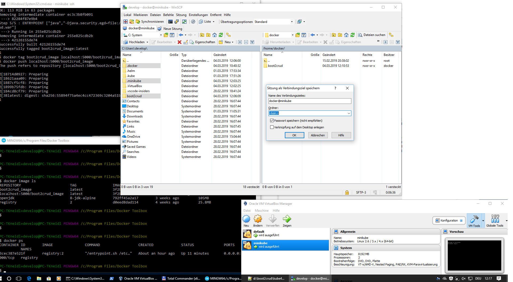
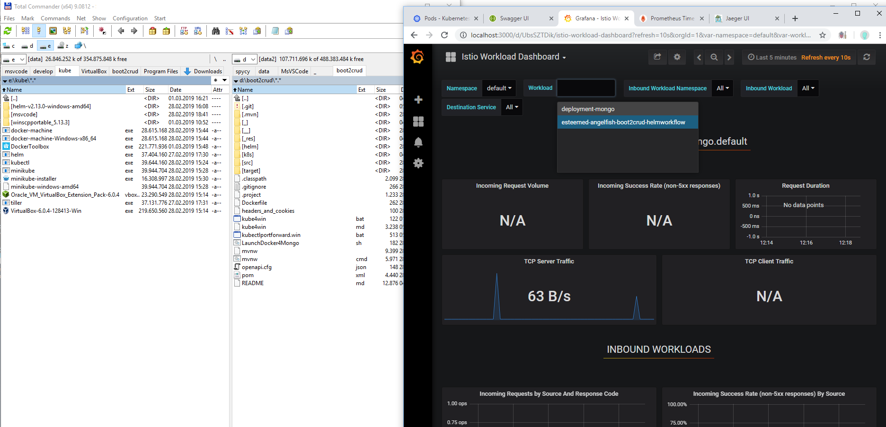
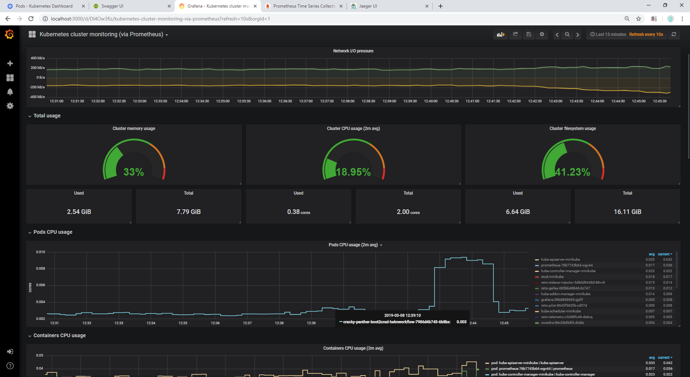

# k8s for Windows

## Software
1. pre-requisites:
	1. windows 10 with VT-x/AMD virtualization enabled
	2. correct Hyper-V setting (en- or disabled, if you have VirtualBox)
2. install Docker Toolbox for Windows
3. download kubectl.exe
4. download minikube.exe
5. download helm.exe (and tiller.exe)

## Setup k8s
1. put the above binaries into **c:/kube/** & your PATH (eg. by using kube4win.bat, it has to be **C:/**!)
2. // minikube get-k8s-versions	# not possible any more ... :-(
3. start (not as admin) from C:/kube/
	0. execute [kube4win.bat](kube4win.bat)
	1. with virtualbox:
		1. deactivate Windows-features -> hyperv (& reboot & wait some minutes while rebooting)
		2. minikube.exe start --kubernetes-version="v1.13.0" --vm-driver="virtualbox" --memory 8192 --insecure-registry localhost
4. kubectl.exe cluster-info
5. minikube.exe dashboard --url=true	# -> open it!
6. helm init(on host) & start docker registry(**inside** of the minikube VM!) (as described in [README.md](README.md))
	1. (helm-init & docker-registry-setup should be done always after a minikube delete)
7. create dir within the minikube VM
	1. sudo mkdir /data/ghe/expoappmongodbk8s			# /data/ is persistent, most of the dirs inside the minikube VM are non-permanent!
	2. sudo chmod 777 /data/ghe/expoappmongodbk8s		# 777 = world writable (775 would be group-writable only)

## Install istio
1. download istio ZIP manually & unpack
2. exec in itio's dir:
	1. helm template install/kubernetes/helm/istio --name istio --namespace istio-system --set servicegraph.enable=true --set ingress.enable=true --set tracing.enabled=true --set zipkin.enabled=true --set grafana.enabled=true --set servicegraph.enabled=true --set global.proxy.includeIPRanges="10.0.0.1/24" > ./istio4boot2crud.windows.1.0.5.yaml
	2. kubectl create namespace istio-system
	3. kubectl label namespace default istio-injection=enabled
	4. kubectl apply -f ./istio4boot2crud.windows.1.0.5.yaml
	5. pray! (+check in the k8s dashboard or with cmd 'kubectl get pods -n istio-system')

Alternative: execute [./k8s/istio.install.without.mtls.bat](./k8s/istio.install.without.mtls.bat) in the dir of istio.
	
## Install your app
1. check if minikube & istio are up & running fine! use command:
	1. kubectl get pods -n istio-system
2. helm install boot2crud-helmworkflow/ (as described in [README.md](README.md#helm))
3. kubectl port-forward (not all of these is needed on linux...) (or use [kubectlportforward.win.bat](kubectlportforward.win.bat))
	1. kubectl port-forward {deployment}-{name}-boot2crud-helmworkflow-{podname} 8080
	2. kubectl port-forward prometheus-{podname} 9090 -n istio-system
	3. kubectl port-forward grafana-{podname} 3000 -n istio-system
	4. kubectl port-forward istio-tracing-{podname} 16686 -n istio-system		# jaeger ui

## Gotchas:
1. Error restarting cluster: restarting kube-proxy: waiting for kube-proxy to be up for configmap update: timed out waiting for the condition
	1. try minikube delete and del c:/Users/{un}/.minikube/ and start the setup again...
2. Istio dashboards show only a few data
	1. ensure your installed artifacts are named, especially port's have to have name's

## Running 2 VMs (docker & minikube) on Windows with VirtualBox, accessing them with WinSCP(docker:tcuser):

#### Monitoring of the Cluster (grafana plugin: 9135)

